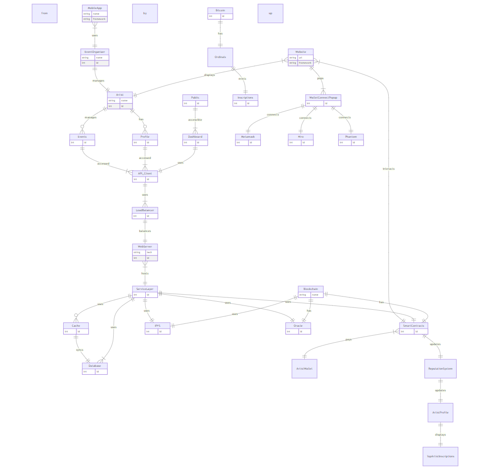

# Web3 Music Platform [W3AR]

  

A decentralized platform harnessing the power of blockchain to connect artists, event organizers, and music enthusiasts.

## Table of Contents
- [Web3 Music Platform \[W3AR\]](#web3-music-platform-w3ar)
  - [Table of Contents](#table-of-contents)
  - [Introduction](#introduction)
  - [Frontend Architecture](#frontend-architecture)
    - [Components](#components)
    - [Flow](#flow)
  - [Backend Architecture](#backend-architecture)
    - [Components](#components-1)
    - [Flow](#flow-1)
  - [Blockchain Integration](#blockchain-integration)
    - [Components](#components-2)
    - [Flow](#flow-2)
  - [Wallet Connectivity](#wallet-connectivity)
    - [Components](#components-3)
    - [Flow](#flow-3)
  - [Website Screen Shots](#website-screen-shots)
  - [Diagrams](#diagrams)
  - [Conclusion \& Future Scope](#conclusion--future-scope)
  - [Support \& Contributions](#support--contributions)

## Introduction

The Web3 Music Platform is set to redefine the music industry by creating a trustless, decentralized environment. By leveraging the capabilities of blockchain, the platform ensures transparent, immutable, and secure interactions for artists, event organizers, and users.

## Frontend Architecture

### Components

- **Website (Next.js)**: Main web portal offering a feature-rich experience.
- **Artist**: Dedicated space for artists to showcase their talent and interact with event organizers.
- **Public**: A segment allowing general users to discover artists, events, and more.
- **Dashboard**: A comprehensive control panel for users, artists, and organizers.
- **Mobile App**: An app extending platform functionalities to mobile devices.
- **Event Organizer**: Mobile-centric features for organizing and managing events.
- **Profile**: Detailed artist profiles with their music, events, and ratings.
- **Events handle**: Manages upcoming and past events related to artists.

### Flow

- Users begin their journey on the **Website**, with options to explore the **Artist** section, and general **Public** content.
- The **Dashboard** offers a deeper dive into functionalities, with seamless integration with the **API Client**.
- On mobile devices, the **Mobile App** focuses on event organization and dynamic artist interactions.

## Backend Architecture

### Components

- **Load Balancer**: Distributes incoming requests ensuring optimal performance.
- **Web Servers**: Handle user requests and backend processing.
- **Node.js**: Executes server-side logic.
- **Service Layer**: Manages core business logic and data operations.
- **Cache**: Enhances performance by temporarily storing frequent data.
- **Database**: Central storage solution for all persistent data.

### Flow

- **Load Balancer** directs traffic to **Web Server1** or **Web Server2**.
- Servers leverage **Node.js** for processing, further interfacing with the **Service Layer**.
- Data operations are enhanced using the **Cache** or stored persistently in the **Database**.

## Blockchain Integration

### Components

- **Stacks Network**: The foundational blockchain infrastructure.
- **Smart Contracts**: Smart contract made on clarity, including nft, platform, rating, escrow smart contracts for the release or funds etc.
- **IPFS - GAIA**: A distributed file system for decentralized data storage.
- **Oracle**: Feeds external, real-world data to the platform's smart contracts.
- **Artist's Wallet**: Digital wallet for artists to manage tokens or digital assets.
- **Reputation System**: Transparently rates artists based on performance and user feedback.
- **Artist Profile**: Showcases artists, their ratings, inscriptions, and other relevant data.

### Flow

- **Stacks Network** integrates with **Smart Contracts**, **IPFS - GAIA**, and **Oracle** to form the blockchain backbone.
- Various platform functionalities like gig applications, availability confirmations, and contract interactions are managed by **Smart Contracts**.
- Ratings, inscriptions, and metadata are transparently managed and displayed on the **Artist Profile**.

## Wallet Connectivity

### Components

- **Popup**: UI prompting users to select their preferred digital wallet.
- **Metamask, Hiro, Phantom**: Supported wallets for secure digital transactions.

### Flow

- Initiating "Wallet Connect" on the **Website** triggers the **Popup**.
- Users can then seamlessly connect their **Metamask**, **Hiro**, or **Phantom** wallets to the platform.

## Website Screen Shots

Here are the screen shots of the Web3 Music Platform:

  
   
  <i>Home Page</i>

  
   
  <i>Wallet Connect</i>

  
   
  <i>Featured Musicians</i>

  
   
  <i>Event Organizers</i>

  
   
  <i>Top Artist Inscriptions</i>

  
   
  <i>Profile Page</i>

  
   
  <i>GIGS Page</i>

  
   
  <i>Inscription</i>

## Diagrams

Below are the diagrams related to the Web3 Music Platform:

  
   
  <i>UML Diagram</i>

  
   
  <i>ER Diagram</i>

## Conclusion & Future Scope

The Web3 Music Platform stands as a beacon for the future of the music industry. By seamlessly integrating frontend interactions, backend processing, blockchain technologies, and wallet connectivity, the platform offers a holistic, decentralized experience for all stakeholders. As we move forward, we aim to integrate more blockchain networks, support additional digital wallets, and introduce AI-driven insights for artists and organizers.

## Support & Contributions

For queries, feedback, or contributions, please reach out to our [support team](mailto:support@web3musicplatform.com). We believe in community-driven development and welcome any suggestions or pull requests.

